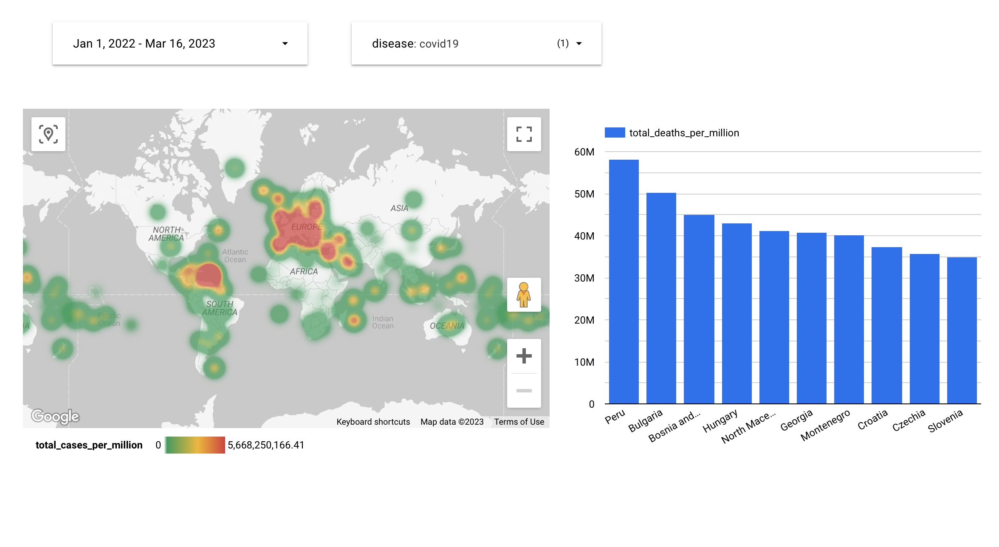
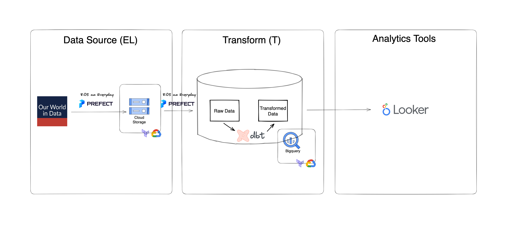

# Comparison between Covid-19 and Monkeypox Cases

## Overview

This project was executed as a part of the Data Engineering Zoomcamp course held by [DataTalks.Club](https://github.com/DataTalksClub/data-engineering-zoomcamp). The goal of this project is to apply everything we learned in this course and build an end-to-end data pipeline and a visualized dashboard.
  
The [dashboard](https://lookerstudio.google.com/reporting/b50954f0-11ae-4314-b0fa-9ce222f517a6):    

  
## Problem description

This project is related to covid-19 and monkeypox diseases. ​​Which area has the highest prevalence rate? Does a high covid-19 prevalence rate area also have a high monkeypox prevalence rate? How is the case fatality rate between covid-19 and monkeypox?

## Dataset

The data resource is form [Our World in Data](https://github.com/owid).

```
who_disease  
	|- location string
	|- iso_code string
	|- date string
	|- total_cases float
	|- total_deaths float
	|- new_cases float
	|- new_deaths float
	|- new_cases_smoothed float
	|- new_deaths_smoothed float
	|- new_cases_per_million float
	|- total_cases_per_million float
	|- new_cases_smoothed_per_million float
	|- new_deaths_per_million float 
	|- total_deaths_per_million float 
	|- new_deaths_smoothed_per_million float
	|- disease_type string
```

## Technologies

- Google cloud Platform
  - Compute Engine (Optional)
  - Cloud Storage
  - Bigquery
- Terraform
- prefect
- dbt
- Looker

## Project architecture

  

## Prequisites

- Python 3 (installed with Anaconda): https://www.anaconda.com
- Google Cloud SDK: https://cloud.google.com/sdk/docs/install-sdk
- Terraform: https://developer.hashicorp.com/terraform/downloads

## GCP setup

Please follow this [note](https://github.com/ziritrion/dataeng-zoomcamp/blob/main/notes/1_intro.md#user-content-gcp-initial-setup).
  
If you have problems setting up the env, you can create a virtual machine for this project.  

Please follow this [video](https://www.youtube.com/watch?v=ae-CV2KfoN0&list=PL3MmuxUbc_hJed7dXYoJw8DoCuVHhGEQb) and only need to follow these parts:  
- Generating SSH keys
- Creating a virtual machine on GCP
- Connecting to the VM with SSH
- Installing Anaconda
- Creating SSH config file
- Accessing the remote machine with VS Code and SSH remote
- Installing Terraform
  
## Reproduction steps

1. Initial setup  

	1. Fork this repo

	2. Clone your folked repo

	```bash
	git clone <your-repo-url>
	cd DE_ZOOMCAMP_PROJECT
	```

	3. Create env with conda and activate
  
	```bash
	conda create -n <env_name> python=3.9
	```
	```bash
	conda activate <env_name>
	```

	4. Install required libraries
  
	```bash
	pip install -r requirements.txt
	```

	5. Navigate to `terraform` folder, fill in the blanks in `variables.tf` and then init terraform
  
	```bash
	terraform init
	```
  
	6. Plan the infrastructure
  
	```bash
	terraform plan
	```
  
	7. Apply the changes
  
	```bash
	terraform apply
	```
	The google cloud storage and bigquery dataset should be created.

2. dbt set up

	1. Set up a `profiles.yml` file in `~/.dbt`
  
	```bash
	mkdir ~/.dbt
	cd ~/.dbt
	```
	profiles.yml
	
	```yaml
    bq-dbt-who:
      target: dev
      outputs:
        dev:
          dataset: dbt_who_data
          fixed_retries: 1
          keyfile: <google credentials json file>
          location: US
          method: service-account
          priority: interactive
          project: <GCP project id>
          threads: 4
          timeout_seconds: 300
          type: bigquery
	```

	2. Fill in the blank in `dbt/who_disease_data/models/schema.yml`

3. Deployment  

	1. Navigate to `prefect` folder and start prefect server
  
	```bash
	prefect orion start
	```

	2. Create prefect blocks via `google_cloud.py`
  
	```bash
	python blocks/google_cloud.py \
		--service_account_file=<path for gcp_credentials_file> \
		--gcp_credentials_block_name=<name for gcp_credentials_block> \
		--gcs_bucket_name=<name for bucket_name> \
		--gcs_bucket_block_name=<name for gcs_bucket_block_name>
	```
	> Default gcp_credentials_block and gcs_bucket_block_name are "zoomcamp". 
	> If you set the different name, remember to change the block name in flow.
  
	3. Deploy the flow and run

	```bash
	prefect deployment build flows/elt_parent_flow.py:elt_parent_flow -n "who_elt_deployment" --cron "5 8 * * *" -a
	```
	> You can adjust the cron argument.
	```bash
	prefect deployment run elt_parent_flow/who_elt_deployment
	```

	4. Start the prefect agent
	```bash
	prefect agent start -q "default"
	```

3. Visualization - Looker

	1. Create a blank report in [Looker](https://lookerstudio.google.com/u/1/navigation/reporting)
	> The google account used for looker need to be same with GCP account.

	2. Connect the google bigqeury table

	3. Create the charts you want

## Troubleshooting

1. If flow can't find dbt command, add directory which `dbt` exist to `$PATH` environment variable, please check `prefect_dbt_flow.py`

## Reference
1. [DataTalksClub](https://github.com/DataTalksClub/data-engineering-zoomcamp)
2. [Note from Alvaro Navas](https://github.com/ziritrion/dataeng-zoomcamp/blob/main/notes/1_intro.md#user-content-gcp-initial-setup)
3. [How to run a Prefect 2 agent as a systemd service on Linux](https://discourse.prefect.io/t/how-to-run-a-prefect-2-agent-as-a-systemd-service-on-linux/1450)  
If you want to keep your prefect agent running.
